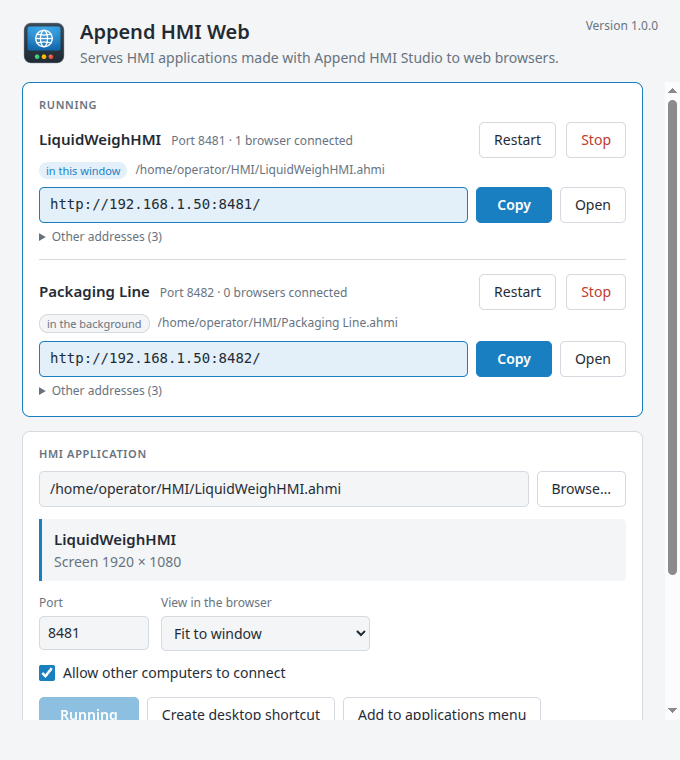
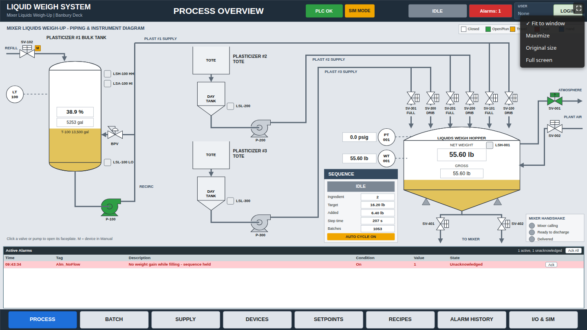

Append HMI Web
==============

**Append HMI Web** serves HMI applications (`.ahmi` projects) made with [Append HMI Studio](https://github.com/AppendAutomation/AppendHMIStudio) to web browsers. Start it on one PC; operators open the link on any computer, tablet or phone on the network, with live PLC data and no software to install on their side.



- **From the command line:** `append-hmi-web project.ahmi` starts the project's web server.
  - `--port`, `--view` and `--local-only` set it up.
  - `--headless` runs it without a window, for a service.
- **From the launcher:** with no project, a window opens where you:
  1. pick an `.ahmi` file;
  2. set the **port** (default **8480**) and the browsers' **view**;
  3. choose whether **other computers** may connect;
  4. **Start web server**, or create a **desktop shortcut** or **menu entry** that starts it with those settings.
- **The link:** once the server runs, the launcher shows the link to open, with **Copy** and **Open** buttons, the other addresses the PC answers on, and how many browsers are connected.
- **View options in the browser:** a small button in the top right corner of the page offers:
  - **Fit to window:** the whole screen, keeping its proportions;
  - **Maximize:** stretched to fill the window;
  - **Original size:** 1:1, with scroll bars;
  - **Full screen.**
  - Each browser remembers its choice; the launcher sets the starting one.

  

- **Everything the Studio's Run does:**
  - live PLC data through the bundled `hmi-comms` server (EtherNet/IP ControlLogix/CompactLogix, SLC 5/05 and MicroLogix, Modbus TCP, simulator);
  - alarms with CSV history;
  - retentive tags;
  - users and access levels;
  - recipes (RecipeExport downloads the CSV file; RecipeImport opens the browser's file picker).
- **Several projects at once**, each on its own port.

Why port 8480? 8080 and 8088 are often taken on plant PCs (other web servers, Ignition), and a port above 1024 needs no administrator rights.

Managing running servers
------------------------

- **One list for the whole PC:** the launcher's **Running** list shows every Append HMI Web server on this computer: its own, and servers started separately (with `--headless`, or by another launcher shortcut), marked **in the background**.
- **For each server:** the application, its file, its port and how many browsers are connected.
- **Restart:** stops the server and starts it again with the same settings, reading the `.ahmi` file afresh. Restart after saving changes in Studio; connected browsers reload by themselves.
- **Stop:** stops the server. A background process exits once its last server stops.
- **Closing the launcher:** stops its own servers, after asking. Background servers keep running.

How it works: each server is recorded in `servers/` in the settings folder, with a random token readable only by your user account. A launcher sends Stop and Restart to the server's control address (`/hmi-web/control`), which answers only requests from this computer that carry that token.

How browsers share the application
----------------------------------

Every browser runs the application for itself, like separate operator panels on one machine:

- **Per browser:** its own connection to the PLCs, its own login (users and access levels apply per browser) and its own alarm acknowledgements.
- **Shared, kept on the server:**
  - **alarm history:** each real change is written once, however many browsers see it or when they open;
  - **retentive values**;
  - **user changes** made at run time;
  - **saved recipes:** a recipe saved in one browser appears in the others within a few seconds.
- **Updates:** saving a new version of the `.ahmi` file and refreshing the browser loads it.
- **Server restarts:** if the server stops, browsers show "Connection lost" and reload by themselves when it's back.

Security
--------

- **Who can connect:** anyone who can reach the port can operate the HMI, as anyone at a panel could.
  - Use the application's users and access levels (Studio's HMI > Users and the Enable animation) to protect controls.
  - Untick **Allow other computers to connect** (`--local-only`) to serve this PC alone.
- **Plain HTTP:** the server is meant for the plant network. Don't expose it to the internet.
- **What it serves:** only the files the HMI page needs, never other files on the PC.
  - The WebSocket accepts only the server's own page.
  - The page runs under a strict Content Security Policy.
- **Windows Firewall:** the Windows installer lets other computers reach Append HMI Web on **private and domain** networks, never public ones.

Command line
------------

```
append-hmi-web [options] [project.ahmi]

  --port <n>                 Web server port (default 8480).
  --view <fit|fill|original> How browsers show the screen at first. Default fit.
  --local-only               Only this computer can connect (127.0.0.1).
  --headless                 No window: print the link and serve until stopped
                             (from the launcher's Running list, Ctrl+C or the OS).
  --create-shortcut <where>  Create a shortcut that starts the server with these
                             options, then exit (<where>: desktop or menu).
  --disable-acceleration     Turn off GPU acceleration.
  -h, --help                 Show help.
  -v, --version              Show the version.
```

- **Exit codes:** 0 on success, 1 when the project or port can't be used, 2 for a usage error.
- **Windows executable:** `C:\Program Files\Append HMI Web\Append HMI Web.exe`.
- **Remembered settings:** without options, a project starts with the port, view and access it last used.
- **Shortcuts:** created per user, with the settings in the command:
  - Windows: `Desktop\<project> (web).lnk` and Start menu > Append HMI Web;
  - Linux: `~/Desktop` and `~/.local/share/applications`.

Download
--------

Releases are published at [github.com/AppendAutomation/AppendHMIWeb/releases](https://github.com/AppendAutomation/AppendHMIWeb/releases):

- `Append-HMI-Web-<version>-Setup.exe`
  - Windows 10/11 x64, for all users.
  - Silent install: `/S`. Silent uninstall: `"C:\Program Files\Append HMI Web\Uninstall.exe" /S`.
- `Append-HMI-Web-<version>-x86_64.AppImage`: Linux, runs without installing.
- `Append-HMI-Web-<version>-amd64.deb`: Debian and Ubuntu.

The installers are not code-signed yet, so Windows SmartScreen asks for confirmation on first run.

Settings, logs and project data are kept in:
- `%APPDATA%\Append HMI Web` on Windows;
- `~/.config/Append HMI Web` on Linux.

The log is `logs/main.log`.

How it works
------------

Append HMI Web reuses Append HMI Studio's run-only renderer, comms server and data stores unchanged, from the `studio/` submodule, as [Append HMI Desktop](https://github.com/AppendAutomation/AppendHMIDesktop) does.

- **Serving:** the server sends the editor web app's runtime files (46 of its 156 MB, gzipped on the way).
- **The bridge:** before the page's own scripts, it loads a small bridge (`src/web/bridge.js`) that stands in for Electron's preload. The runtime's requests go to the server over a WebSocket.
- **The server's side:** it answers those requests as Studio's main process does for a published package, one session per browser.

Building
--------

With Node.js 22.12+ and the .NET 8 SDK:

```
git clone --recursive https://github.com/AppendAutomation/AppendHMIWeb.git
cd AppendHMIWeb
npm install
npm run build-comms       # the hmi-comms server, into studio/comms/publish/
npm start                 # the launcher; npm start -- --headless path/to/project.ahmi serves one
npm test
npm run dist-win          # Windows installer (on Linux too, no wine)
npm run dist-linux        # AppImage and deb
```

| Path | Contents |
|---|---|
| `src/main/` | Main process: command line, launcher, web server (`server.js`), browser sessions (`rpc.js`), shortcuts |
| `src/web/bridge.js` | The browser side of the bridge |
| `src/launcher/` | The launcher window (plain HTML, no editor code) |
| `studio/` | Submodule: [AppendHMIStudio](https://github.com/AppendAutomation/AppendHMIStudio), with its drawio fork and comms server |
| `scripts/` | Build scripts: installers, NSIS download, icons |
| `src/test/` | Unit tests (`npm test`) |

License and attribution
-----------------------

Append HMI Web is © 2026 Append Automation and is licensed under the Apache License 2.0 (see [LICENSE](LICENSE)).

It is built on Append HMI Studio, which is built on the [draw.io](https://github.com/jgraph/drawio) diagram editor and [drawio-desktop](https://github.com/jgraph/drawio-desktop) by JGraph Ltd, used and modified under the Apache License 2.0. [NOTICE](NOTICE) lists the third-party works. Append HMI Web is not affiliated with or endorsed by JGraph Ltd; "draw.io" is a trademark of its owner.
